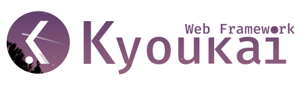
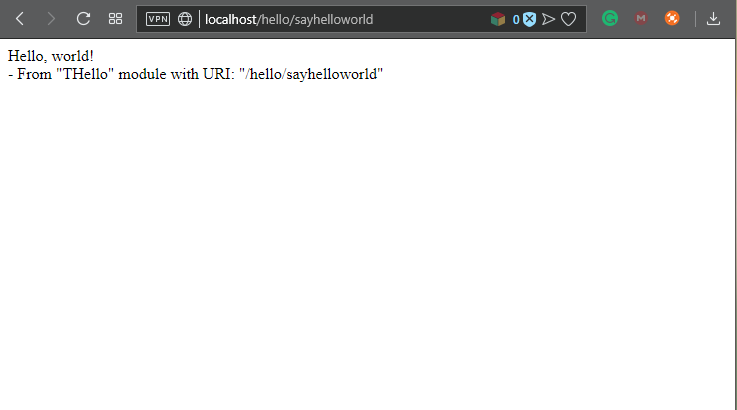
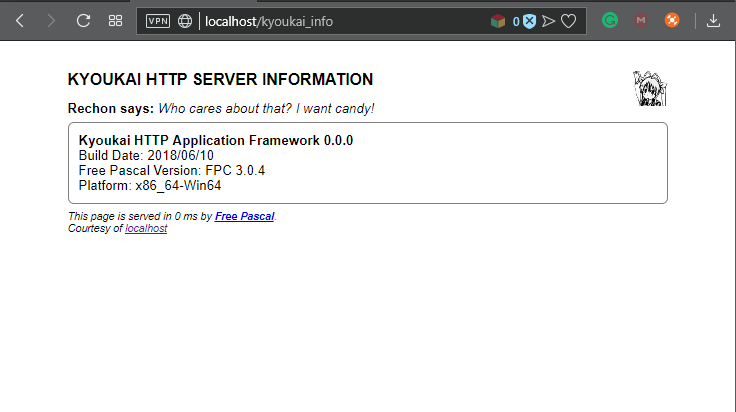
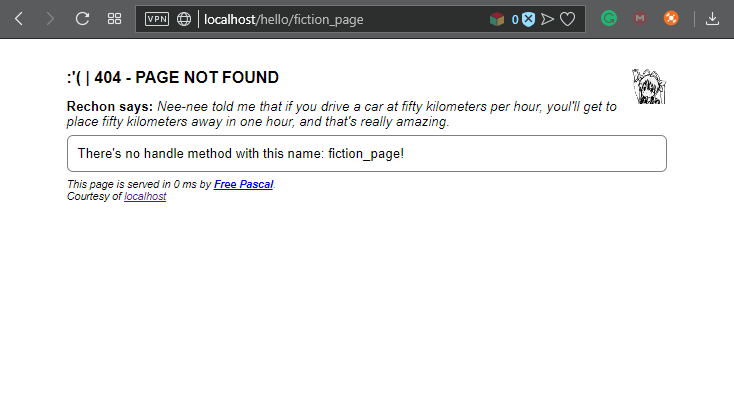

<div align="center">
  
</div>

<div align="center">
  <strong>The Boundary, A Simple Framework for A Small Server Application</strong>
</div>
<br>

The Kyoukai (境界), A Simplified Pascal Web Framework.

In Japanese, Kyoukai means boundary, because the Pascal, it's bounded me as my favorite programming language, no, not like that. The concept is, Kyoukai can be embedded into your desktop application or just leave it as a separated single program, so you can decide which is better, bound it into your existing application or not.

I make it for Pascal because I can not find any Pascal web-framework which I really comfortable with. Some are too complicated, while some others have too many dependencies. Basically, I expect an easy-to-use framework like CodeIgniter in Pascal, even simpler than CodeIgniter.

<b><i>This project is too far from a complete framework, it still in the experimental stage, very unstable and full of dragons, it may destroy your house or kill your kitten, because everything can be changed in this version (0.0.0).</i></b>
Please help me if you have any idea, code, and feature request. And, Don't too silly to open an issue.

<div align="center">

</div>
<div align="center">
<a href="https://badge.fury.io/gh/afuriza%2Fkyoukai_framework"></a>
<a href="https://gitter.im/kyoukai_framework?utm_source=badge&utm_medium=badge&utm_campaign=pr-badge&utm_content=badge"></a>
</div>

Requirements
---
* fpc / free pascal compiler, version 3.0.4
* fcl-web
* kyoukai_framework
* lazarus (optional)

Dependencies
---
* kyoukai_framework
  * kyoukai_standard.lpk

People Involved
---
* Dio Affriza - Main Author
* Luri Darmawan - Many Suggestion and Collaboration with ported FastPlaz unit into Kyoukai
* Are you next? Get Involved!

Roadmap
---
- [ ] making translation file to show server message in other languages
- [ ] add an option to produce error message with json or html
- [ ] Ultibo HTTP Server support
- [x] CGI App support
- [ ] FastCGI App support
- [ ] Lazarus Project Wizard

Known errors
---
- [ ] fixing bug when embedding into existing application. (partially fixed)
- [x] ~~fixing webview memleak with threaded := true~~ (partially fixed)

<br>
<br>
<div align="center">
  
</div>
<div align="center">
  <h2>Let's getting started!</h2>
</div>

Create two files:

* `project_kyoukai.lpr`;
* `unit1.pas`;

In `project_kyoukai.lpr`, type:

```pascal
program project_kyoukai;

{$mode objfpc}{$H+}

uses
  {$IFDEF UNIX}{$IFDEF UseCThreads}
  cthreads,
  {$ENDIF}{$ENDIF}
  Classes,
  kyoukai.standard.HTTPApplication,
  {You must placed your module units here or Kyoukai can't register anything!}
  unit1
  { you can add units after this };

{$R *.res}

begin
  KyoukaiApp.Port := 80;
  KyoukaiApp.Run;
end.
```

In `unit1.pas`, type:

```pascal
unit unit1;

{$mode objfpc}{$H+}

interface

uses
  Classes, SysUtils,
  Kyoukai.Standard.WebRouter,
  Kyoukai.Standard.WebModule;

type
  THome = class(TKyModule)
  published
    procedure MainHandle;
  end;

implementation

procedure THome.MainHandle;
begin
  echo('Hello world!');
end;

initialization
Routes['main'] := THome;

end.
```

Compile and run the project `project_kyoukai.lpr`. Now, in your web browser, access the following URL:

```
http://localhost/
```


<h3 align="center">Screenshots</h3>
<h4 align="center">Hello World Demo</h4>
<div align="center">
  
</div>

<h4 align="center">Kyoukai Information Page</h4>
<div align="center">
  
</div>

<h4 align="center">Not Found Default Handler</h4>
<div align="center">
  
</div>
