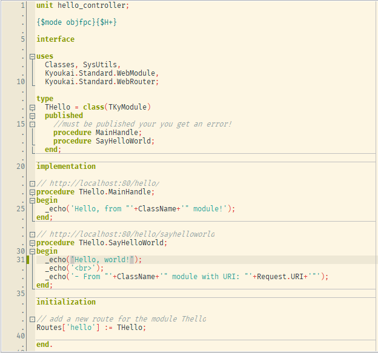
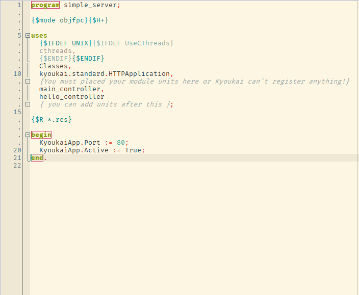

<div align="center">
  
</div>
<br/>
<div align="center">
  <strong>The Boundary, A Simple Framework for A Small Server Application</strong>
</div>
<br/>

The Kyoukai (境界), A Simplified Pascal Web Framework.

In japanese, kyoukai means boundary, because it's bounds me as my favourite programming language, no, not like that. The concept is, Kyoukai can be embedded into your desktop application or just leave it as separated single program, so you can decided which is better, bound it into your existing application or not.

I make it for Pascal because I can not find any Pascal web-framework which I really comfort with. Some are too complicated, while some others have too many dependencies. Basically I expect an easy-to-use framework like CodeIgniter in Pascal, even more simpler than CodeIgniter.

This project is too far from a complete framework, it still in the experimental stage, please help me if you have any idea, code, and feature request. And, Don't too silly to open any issue.

Requirements
---
* fpc / free pascal compiler, version 3.0.4
* fcl-web
* kyoukai_framework
* lazarus (optional)

Dependencies
---
* kyoukai_framework
* -> kyoukai_standard.lpk

<div align="center">
  
</div>
<br/>
<div align="center">
  <strong>Let's getting started!</strong>
</div>
<br/>

Create two files:

* `project_kyoukai.lpr`;
* `unit1.pas`;

In `project_kyoukai.lpr`, type:

```pascal
program project_kyoukai;

{$mode objfpc}{$H+}

uses
  {$IFDEF UNIX}{$IFDEF UseCThreads}
  cthreads,
  {$ENDIF}{$ENDIF}
  Classes,
  kyoukai.standard.HTTPApplication,
  {You must placed your module units here or Kyoukai can't register anything!}
  unit1
  { you can add units after this };

{$R *.res}

begin
  KyoukaiApp.Port := 80;
  KyoukaiApp.Active := True;
end.
```

In `unit1.pas`, type:

```pascal
unit uni1;

{$mode objfpc}{$H+}

interface

uses
  Classes, SysUtils,
  Kyoukai.Standard.WebRouter,
  Kyoukai.Standard.WebModule;

type
  THome = class(TKyModule)
  published
    procedure MainHandle;
  end;

implementation

procedure THome.MainHandle;
begin
  _echo('Hello world!');
end;

initialization
Routes['main'] := THome;

end.
```

Compile and run the project `project_kyoukai.lpr`. Now, in your web browser, access the following URL:

```
http://localhost/
```


<h3 align="center">Screenshots</h3>
<h4 align="center">Hello World Demo</h4>
<div align="center">
  
</div>

<h4 align="center">Kyoukai Information Page</h4>
<div align="center">
  
</div>

<h4 align="center">Not Found Default Handler</h4>
<div align="center">
  
</div>

<h4 align="center">Routing A Module</h4>
<div align="center">
  
</div>

<h4 align="center">Section Code To Run HTTP Server Application</h4>
<div align="center">
  
</div>